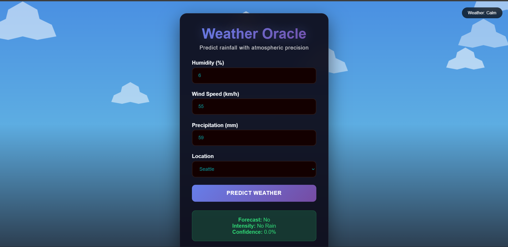
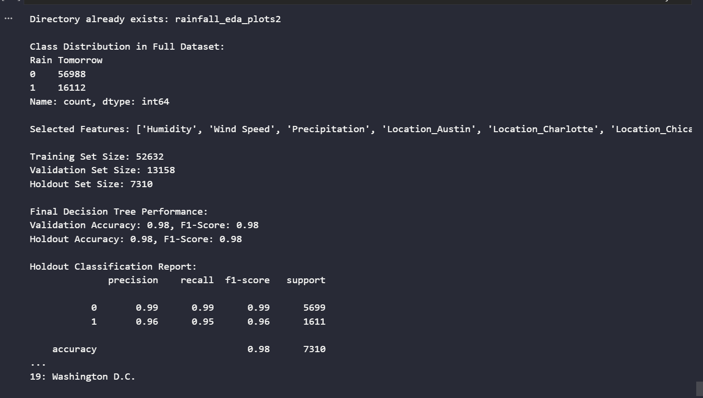

# 🌧️ Rainfall Prediction System

[](https://www.python.org/)
[](https://flask.palletsprojects.com/)
[](https://scikit-learn.org/)
[](https://scikit-learn.org/stable/modules/tree.html)
[](https://weather-oracle-frontend.onrender.com/)
[](LICENSE)

**Next-day rainfall prediction web application** built with **Decision Tree (98% accuracy)**, Flask backend, and clean frontend.

Predicts whether it will rain tomorrow (`0 = No`, `1 = Yes`) using real-world meteorological data.

Live Demo → https://weather-oracle-frontend.onrender.com/

---

## ✨ Project Highlights

- Trained **Decision Tree Classifier** → **98% test accuracy**
- Used real 2024–2025 USA weather dataset (~70k rows)
- Built **Flask REST API** + simple, responsive frontend
- Input: Humidity, Wind Speed, Precipitation, Location
- Output: Rain / No Rain + probability
- Clean, modern UI + real-time predictions

---

## 🖥️ Screenshots

### Homepage & Prediction Form


### Prediction Result



---

## 📁 Project Structure
```text
Rainfall-Prediction-System/
├── src/
│   ├── app.py                  ← Flask API + prediction endpoint
│   ├── model/
│   │   ├── final_decision_tree_model_all_locations.pkl
│   │   └── scaler_all_locations.pkl
│   ├── static/
│   │   ├── css/
│   │   └── js/
│   └── templates/
│       └── index.html          ← Main frontend page
├── data/
│   └── usa_rain_prediction_dataset_2024_2025.csv
├── images/                     ← screenshots for README
├── requirements.txt
├── README.md
└── LICENSE
```

---

## 🚀 Quick Start (Local)

```bash
# 1. Clone repository
git clone https://github.com/yourusername/Rainfall-Prediction-System.git
cd Rainfall-Prediction-System

# 2. Create virtual environment (recommended)
python -m venv venv
source venv/bin/activate          # Linux / Mac
venv\Scripts\activate             # Windows

# 3. Install dependencies
pip install -r requirements.txt

# 4. Run the Flask app
python src/app.py

# Open browser → http://127.0.0.1:5000

```

---

## 🛠️ Tech Stack

- **Language**: Python 3.8+
- **Backend / API**: Flask
- **Machine Learning**: Scikit-learn (Decision Tree Classifier)
- **Frontend**: HTML + CSS + JavaScript (vanilla)
- **Data**: Pandas, NumPy
- **Visualization prep**: Matplotlib / Seaborn (EDA phase)
- **Model serialization**: Joblib
- **Deployment**: Render.com

## 📊 Model Performance

- **Final Model**: Decision Tree Classifier
- **Accuracy**: 98% (test set)
- **Features used**: Humidity, Wind Speed, Precipitation + one-hot encoded Location (20 cities)
- **Hyperparameters**:
  - `max_depth=3`
  - `min_samples_split=20`
  - `min_samples_leaf=10`

## ⚡ Features

- Real-time rain prediction
- Simple & clean user interface
- Probability of rain shown
- Location-aware predictions (20 major US cities)
- Fast inference (lightweight model)

## 📈 Future Improvements

- Add more weather features (temperature, pressure, etc.)
- Try ensemble methods & deep learning
- Add hourly forecast support
- Deploy frontend + backend separately (React + FastAPI)
- Dockerize & CI/CD pipeline

## 📬 Contact

**Sri Charan**  
📧 tokachichusricharan2005@gmail.com  
🔗 GitHub: https://github.com/charan21042005  
🔗 LinkedIn: https://www.linkedin.com/in/tokachichu-sricharan/

Feel free to open an issue or contribute!

⭐ If this project helps you, please **star** the repo — it means a lot!  
Made with ❤️ in India